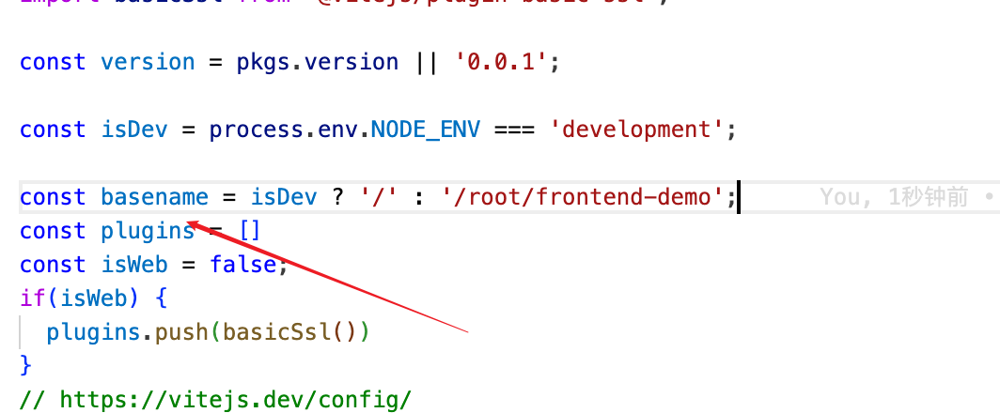

## front deploy demo

```sh
npm i -g @kevisual/envision-cli 

## 添加源地址
envision baseURL -a https://kevisual.silkyai.cn
envision baseURL -l #显示
envision baseURL -s 2 # 设置number

# login
envision login -u root -p ****


# 路径 对应key, 版本
envision deploy ./dist -k frontend-demo -v 0.0.1
# deploy会得到id
envision deploy-load 83b3558b-d4f3-449b-89b3-0f2d61c36de9 # 把上传的东西加载到当前，id是获取的
# 运行后获取访问地址

ev switch root # 切换用户名
```

## vite history 路由需要设置basename

